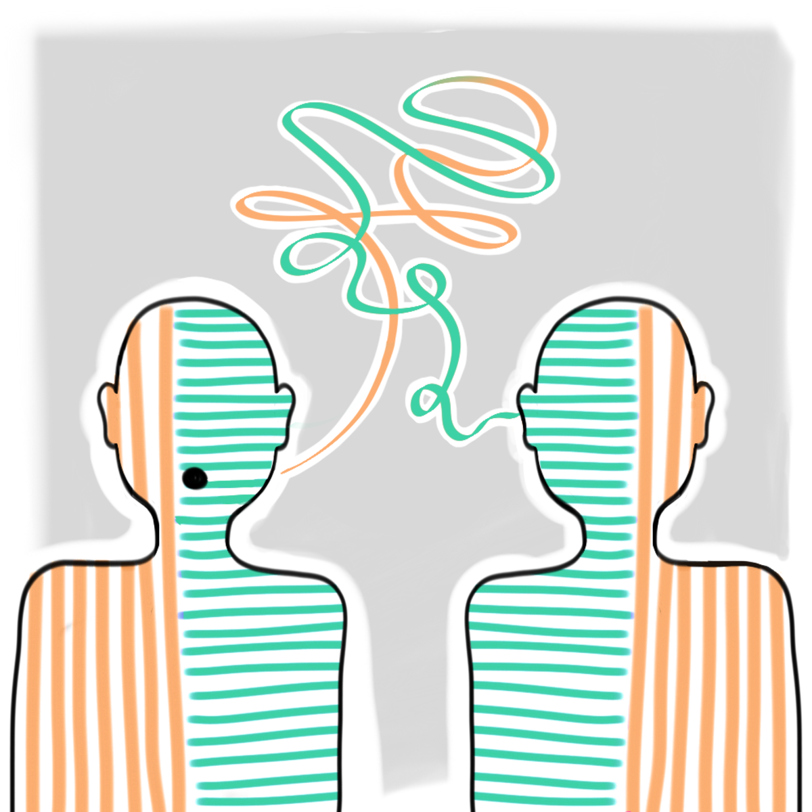

---
layout: work
title: RESEARCH
slug: /research

### Current Work
 
I am currently working on Chinese-English code-switching at [C.Psyd](https://c-psyd.github.io/).

### Previous Work
 
Previously, I investigated [how well neural networks "understand" abstract English syntax](https://aclanthology.org/2020.conll-1.39.pdf). I have also worked on [racial bias](https://arxiv.org/pdf/1905.12516.pdf?ref=https://githubhelp.com) and [abusive language](https://arxiv.org/pdf/2005.13041.pdf). 

For a full list of my publications, please see my [Google Scholar](https://scholar.google.com/citations?user=EOkUV58AAAAJ&hl=en | width=200) page. 

### News: 
Summer 2022: I will be participating in the [JSALT 2022](https://www.clsp.jhu.edu/2022-eighth-frederick-jelinek-memorial-summer-workshop/) workshop on [multilingual and code-switching speech recognition](https://www.clsp.jhu.edu/multilingual-and-code-switching/)!

